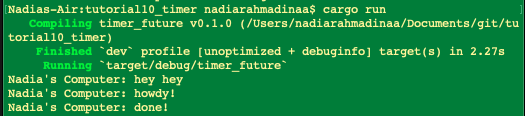

# Refleksi

Hasil ini menunjukkan bahwa print "hey hey" menjadi output paling pertama karena ini adalah synchronous print biasa. Kemudian executor akan mulai setelah code untuk print "hey hey" dijalankan. Ketika executor mulai, "howdy!" akan keprint sebagai asynchronous task pertama. Kemudian executor akan pause selama 2 detik. Baru kemudian program akan diakhiri dengan print "done!". Dari contoh ini, terbukti bahwa asynchronous blocks bersifat lazy dan harus menunggu executor atau .await untuk dapat jalan.