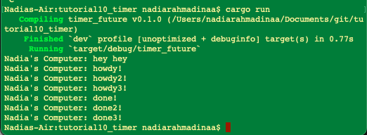
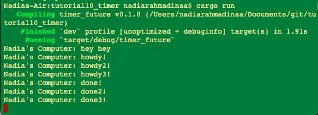

## Refleksi 1: Penjelasan output

Hasil ini menunjukkan bahwa print "hey hey" menjadi output paling pertama karena ini adalah synchronous print biasa. Kemudian executor akan mulai setelah code untuk print "hey hey" dijalankan. Ketika executor mulai, "howdy!" akan keprint sebagai asynchronous task pertama. Kemudian executor akan pause selama 2 detik. Baru kemudian program akan diakhiri dengan print "done!". Dari contoh ini, terbukti bahwa asynchronous blocks bersifat lazy dan harus menunggu executor atau .await untuk dapat jalan.

## Refleksi 2: drop(spawner);

Pada foto pertama dengan drop(spawner); dapat terlihat bahwa setelah selesai mengeksekusi semua program asynchronous, program berhenti. Pada foto kedua, tanpa statement tersebut maka program akan tetap jalan. Disini, program akan tetap jalan tanpa ada task jelas yang ditunggu. Statement drop berfungsi untuk memberi tahu ke executor bahwa tidak ada task lagi yang ditunggu sehingga program bisa end. Tanpanya, executor akan menunggu task karena spawner masih hidup sehingga program akan hang dan tidak melakukan apa-apa.